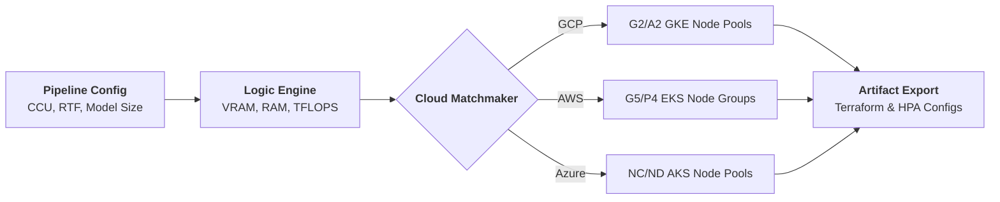

  
  
  # ⚖️ FinOps Estimator
  ### *The Solutions Architect's AI Blueprinting Compass*
  
  
  
  

  **Bridge the gap between AI research and production-grade architecture.**  
  Estimate VRAM, Resource Footprints, and Multi-Cloud OpEx with mathematically-backed precision.

---

An open-source capacity planning and **FinOps estimation tool** for production-grade Conversational AI pipelines. This project is built to bridge the gap between AI research and real-world solution architecture, providing a mathematically-backed "compass" for infrastructure design.

## 🚀 Key Architectural Pillars

### 1. Multi-Resource Footprint
We go beyond simple VRAM calculators. We track the entire infrastructure stack:
- **GPU VRAM**: Weights, KV Cache (vLLM PagedAttention), and component overhead.
- **System RAM**: Host memory for model runtimes and audio buffering.
- **CPU Cores**: Dedicated vCPU recommendations based on architecture.

### 2. Compute Estimation (TFLOPS)
Match your workload with the right hardware using our **Required Compute (TFLOPS)** engine:
- `TFLOPS = 2 × Params × Total_Throughput`.
- Compare your needs against reference points like NVIDIA **H100**, **A100**, and **L4** to avoid over-provisioning.

### 3. Deployment Strategy Simulation
Test how your architecture scales across different patterns:
- **Monolithic (AIO)**: Single-instance, all-in-one pods.
- **Distributed**: Microservices-based pods for STT, LLM, and TTS separately.

### 4. FinOps & Hardware Matchmaker
Find the most cost-effective cloud GPUs (GCP, AWS, Azure) or calculate the **On-Prem ROI** (CapEx vs. OpEx) to decide when it's time to build your own cluster.

---

## 🏛️ Solution Architecture Blueprint

The FinOps Estimator transforms complex model parameters and concurrency requirements into a professional infrastructure verdict.

---

## 🚀 Strategic Capabilities

| Feature | Description | Architect Value |
| :--- | :--- | :--- |
| **Multi-Resource Modeling** | Tracks GPU VRAM, System RAM, and vCPU Cores simultaneously. | Avoid "CPU Traps" and bottlenecks. |
| **Compute Verification** | Maps throughput against GPU TFLOPS (H100, A100, L4). | Prevent over-provisioning. |
| **FinOps Blueprint** | Integrated Spot/Preemptible savings across GCP, AWS, and Azure. | Real-world OpEx predictability. |
| **Granular Customization** | Independent "Use Custom" toggles for STT, LLM, and TTS. | High-fidelity POC simulation. |
| **Infrastructure-as-Code** | Dynamic **Terraform Export** based on architecture verdict. | Rapid baseline provisioning. |

---

## 🛠️ Technical Implementation

### Core Principles
- **Mathematically Backed**: Formulas derived from vLLM PagedAttention, TensorRT-LLM, and Pipecat benchmark data.
- **Consultative UX**: Real-time "Solution Architect Verdict" banner that changes based on CCU and precision.
- **Production-Ready**: Export standard Kubernetes HPA and Terraform configurations directly from the results tab.

### Getting Started

1.  **Clone the repo**: `git clone https://github.com/JoesSattes/FinOps-Estimator.git`
2.  **Install**: `npm install`
3.  **Run**: `npm run dev`
4.  **Export**: `npm run build` (Static export for GitHub Pages)

---

## 🗺️ Architectural Roadmap

- [x] **Phase 1**: Core VRAM & LLM Parameter Logic.
- [x] **Phase 2**: Multi-Cloud FinOps & Solution Verdicts.
- [x] **Phase 3**: Granular Customization & Terraform Export.
- [ ] **Phase 4**: Advanced Latency simulation (p95 prediction).
- [ ] **Phase 5**: Multi-Region "Greener-AI" carbon footprint estimation.

## 🤝 Contributing

This project aims to help everyone understand **real AI solution architecture**. We welcome contributions from architects and researchers to refine our formulas and data presets.

- **[CONTRIBUTOR.md](CONTRIBUTOR.md)**: Read our guide to adding new models and pricing.
- **Formulas**: Based on vLLM, TensorRT-LLM, and Pipecat/LiveKit benchmarks.

---
**March 2026 Update**: Hardware pricing and model presets have been synchronized with latest cloud instance data. Join our [Contributor Network](CONTRIBUTOR.md) to help refine the blueprints.
